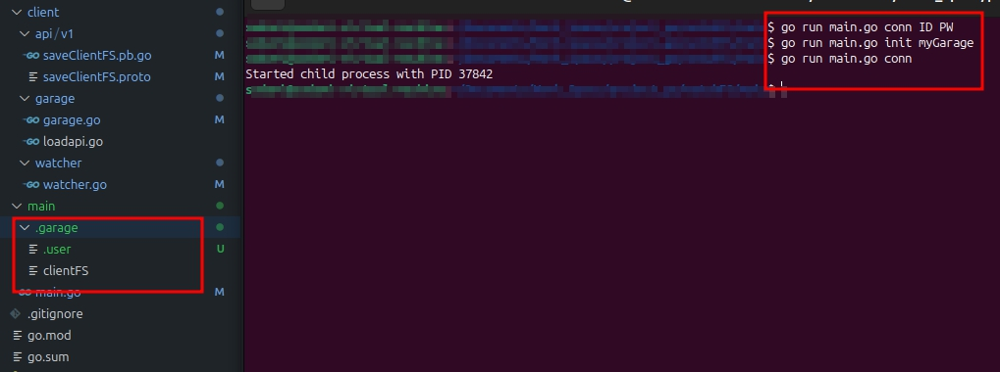
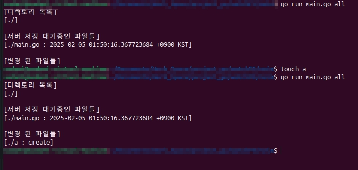

# watchfs - go와 protobuf, gRPC를 사용해서 github를 구현하는 개인 프로젝트이다.
- 클라이언트의 파일 시스템을 감시하고 서버에 변경 사항을 저장한다.
- 클라이언트의 루트 디렉터리의 .garage 디렉터리에 클라이언트의 정보를 저장하고 이 정보를 바탕으로 파일시스템의 변화를 추적하도록 한다.

***
## client 구조
***
## 구조체
```
type fs struct {
	initDir     string 
	directories []string
	allFiles    []map[string]string
	changes     []map[string]string
}
```
- initDir : root 디렉터리의 경로 저장
- directories : root 디렉터리 하위의 모든 디렉터리 경로를 저장하는 슬라이스
- allFiles : root 디렉터리하위의 모든 파일들의 경로(이름) 및 수정시간을 저장하는 슬라이스 맵
- changes : root 디렉터리 하위의 모든 경로안에서 변화를 감지하고 변화된 파일 또는 디렉터리의 정보를 저장하는 맵 슬라이스
***

## 클라이언트 로컬 api
- [garage] conn id pw  : id와 pw로 서비스 접속해서 사용자 인증하고 인증 정보파일 로컬에 생성
- [garage] conn init garageName :  현재 디렉터리를 감시 디렉터리로 사용하고 서버에  garageName이라는 이름의 리모트 생성
- [garage] conn : 현재 디렉터리의 감시 시작
<center>
  
</center>
<center>
  
</center>

- [garage] all : 감시 디렉터리의 모든 파일과 변경사항 출력

<center>
  
</center>

- [garage] changes: 감시 디렉터리의 변경사항 출력
- [garage] save [message] : 현재 변경사항을 메시지와 함께 저장한다. 리모트에 복사할 내용을 저장하고, 변경된 파일들을 임시 디렉터리에 복사해둔다. 롤백을 하는데 사용한다.

<center>
  
</center>
<center>
  
</center>

- [garage] history : 디렉터리의 변경 내역 전체를 출력한다.
<center>
  
</center>

- [garage] stop : 디렉터리 감시를 종료한다.

- saveRemote() -> 서버 저장 대기중인 파일들을 리모트로 전송(복사) 


## 클라이언트 <-> 서버 api
$ garage flush -> 클라이언트 로컬의 파일들을(변경사항들을) 똑같이 서버로 옮김

***

## NewWatcher() 함수
- watcher 인스턴스 생성하는 함수

***

## loadFS() 메서드 - protobuf를 사용한 사용자 파일시스템 정보 불러오기
- 구조체 fs의 메서드로 root 디렉터리 하위의 모든 파일시스템 정보를 가져온다. 
- root 디렉터리에 /.garage/clientFS 파일이 있는지 확인하고 없으면 클라이언트의 파일 시스템을 스캔한다.
- /.garage/clientFS 파일이 있으면 파일에서 클라이언트의 파일시스템 정보를 가져온다.

***

## saveFS() 메서드 - protobuf를 사용해서 사용자 파일시스템 정보 저장하기
- /.garage/clientFS 에서 저장된 정보를 불러온다.

***

## Watch() 메서드 
- root 디렉터리 하위의 모든 변경을 감시하고, 변경사항을 fs.changes에 저장한다.

***

### Wahch() 메서드의 세부적인 기능이다.
#### watchfs 패키지의 테스트를 위해서 만든 /main/main.go 를 실행한다. - 초기 루트 디렉터리 아래의 디렉터리 목록과 파일들 그리고 파일드의 최종 수정시간을 확인할 수 있다.
```
$ go run main.go ./
디렉토리 리스트
./
./temp
디렉토리 / 파일:수정시간 리스트
filename : ./main.go  //  modtime: 2025-01-31 12:45:37.687637885 +0900 KST
filename : ./temp/c  //  modtime: 2025-02-01 21:59:57.280189719 +0900 KST
filename : ./a  //  modtime: 2025-02-01 21:59:30.44578841 +0900 KST
filename : ./b  //  modtime: 2025-02-01 21:59:38.183893229 +0900 KST
filename : ./e  //  modtime: 2025-02-01 22:00:11.76844866 +0900 KST
변경 파일 목록
```
#### ./a 파일을 수정해 보겠다. 파일 수정 메시지와 함께 변경 파일 목록에 ./a의 최종 변경시간이 표시된다. 
```
파일 수정
디렉토리 리스트
./
./temp
디렉토리 / 파일:수정시간 리스트
filename : ./a  //  modtime: 2025-02-01 21:59:30.44578841 +0900 KST
filename : ./b  //  modtime: 2025-02-01 21:59:38.183893229 +0900 KST
filename : ./e  //  modtime: 2025-02-01 22:00:11.76844866 +0900 KST
filename : ./main.go  //  modtime: 2025-01-31 12:45:37.687637885 +0900 KST
filename : ./temp/c  //  modtime: 2025-02-01 21:59:57.280189719 +0900 KST
변경 파일 목록
filename : ./a // 변경사항 : 2025-02-01 22:02:58.194063191 +0900 KST
```
#### 파일 생성 ./d 파일을 생성했다. 변경사항으로는 create로 표시된다.
```
파일생성
디렉토리 리스트
./
./temp
디렉토리 / 파일:수정시간 리스트
filename : ./e  //  modtime: 2025-02-01 22:00:11.76844866 +0900 KST
filename : ./main.go  //  modtime: 2025-01-31 12:45:37.687637885 +0900 KST
filename : ./temp/c  //  modtime: 2025-02-01 21:59:57.280189719 +0900 KST
filename : ./a  //  modtime: 2025-02-01 21:59:30.44578841 +0900 KST
filename : ./b  //  modtime: 2025-02-01 21:59:38.183893229 +0900 KST
변경 파일 목록
filename : ./a // 변경사항 : 2025-02-01 22:02:58.194063191 +0900 KST
filename : ./d // 변경사항 : create

```
#### 디렉토리 생성 - ./temp2 디렉터리를 생성했다. 디렉토리 생성시에는 디렉토리 리스트에만 추가가 된다.
```
디렉터리 생성
디렉토리 리스트
./
./temp
./temp2
디렉토리 / 파일:수정시간 리스트
filename : ./a  //  modtime: 2025-02-01 21:59:30.44578841 +0900 KST
filename : ./b  //  modtime: 2025-02-01 21:59:38.183893229 +0900 KST
filename : ./e  //  modtime: 2025-02-01 22:00:11.76844866 +0900 KST
filename : ./main.go  //  modtime: 2025-01-31 12:45:37.687637885 +0900 KST
filename : ./temp/c  //  modtime: 2025-02-01 21:59:57.280189719 +0900 KST
변경 파일 목록
filename : ./a // 변경사항 : 2025-02-01 22:02:58.194063191 +0900 KST
filename : ./d // 변경사항 : create
```
#### 디렉터리 내부에 파일 생성 - ./temp2/abcd 파일을 추가해보겠다. ./temp2/abcd 가 create 상태로 추가됐다.
```
파일생성
디렉토리 리스트
./
./temp
./temp2
디렉토리 / 파일:수정시간 리스트
filename : ./e  //  modtime: 2025-02-01 22:00:11.76844866 +0900 KST
filename : ./main.go  //  modtime: 2025-01-31 12:45:37.687637885 +0900 KST
filename : ./temp/c  //  modtime: 2025-02-01 21:59:57.280189719 +0900 KST
filename : ./a  //  modtime: 2025-02-01 21:59:30.44578841 +0900 KST
filename : ./b  //  modtime: 2025-02-01 21:59:38.183893229 +0900 KST
변경 파일 목록
filename : ./d // 변경사항 : create
filename : temp2/abcd // 변경사항 : create
filename : ./a // 변경사항 : 2025-02-01 22:02:58.194063191 +0900 KST
```
#### 파일 삭제 - ./e 파일을 삭제한다. 파일 목록에 해당 파일이 포함돼 있지만, 변경 내용에 해당파일의 변경사항으로 delete가 표시되는 것을 확인할 수 있다. 
```
파일삭제 ./e
디렉토리 리스트
./
./temp
./temp2
디렉토리 / 파일:수정시간 리스트
filename : ./a  //  modtime: 2025-02-01 21:59:30.44578841 +0900 KST
filename : ./b  //  modtime: 2025-02-01 21:59:38.183893229 +0900 KST
filename : ./e  //  modtime: 2025-02-01 22:00:11.76844866 +0900 KST
filename : ./main.go  //  modtime: 2025-01-31 12:45:37.687637885 +0900 KST
filename : ./temp/c  //  modtime: 2025-02-01 21:59:57.280189719 +0900 KST
변경 파일 목록
filename : ./a // 변경사항 : 2025-02-01 22:02:58.194063191 +0900 KST
filename : ./d // 변경사항 : create
filename : temp2/abcd // 변경사항 : create
filename : ./e // 변경사항 : delete
```
#### 만약 클라이언트가 로컬에서 서버와 연결이 되지 않은 상태에서 파일을 수정,삭제,생성 하는 경우 이후 서버에 접속하게 되면 저장된 클라이언트의 정보와 현재 클라이언트의 정보를 비교해서 변겨 사항을 수정한다.
```
디렉토리 리스트
./
디렉토리 / 파일:수정시간 리스트
filename : ./a  //  modtime: 2025-02-03 03:39:24.530227569 +0900 KST
filename : ./b  //  modtime: 2025-02-03 03:39:27.103276789 +0900 KST
filename : ./main.go  //  modtime: 2025-02-03 02:25:47.792788041 +0900 KST
변경 파일 목록
```
#### 프로세스를 종료한 상태에서 파일 c를 추가하고, 파일 a를 수정하고, 파일 b를 삭제하겠다.
```
디렉토리 리스트
./
디렉토리 / 파일:수정시간 리스트
filename : ./a  //  modtime: 2025-02-03 03:39:24.530227569 +0900 KST
filename : ./b  //  modtime: 2025-02-03 03:39:27.103276789 +0900 KST
filename : ./main.go  //  modtime: 2025-02-03 02:25:47.792788041 +0900 KST
변경 파일 목록
changes : ./c // 변경사항 : create
changes : ./a // 변경사항 : 2025-02-03 03:40:43.158834245 +0900 KST
changes : ./b // 변경사항 : delete
```

***

## Save() 메서드
- DirSearch() 메서드로 fs.allFiles 필드의 정보를 갱신하고, 해당 내용을 데이터베이스와 서버에 저장한다. fs.chages는 초기화 된다.

***

### 데이터베이스
- mySQL을 사용한다. 사용자정보(id/pw) 테이블, 사용자 레포지토리 정보 테이블, 레포지토리의 모든 경로(디렉토리, 파일) 와 최종 수정시간에 대한 데이터가 있다.
### 서버
- 사용자id/root 디렉터리/ 하위에 모든 정보가 사용자의 로컬과 동일한 정보가 담겨있다. 